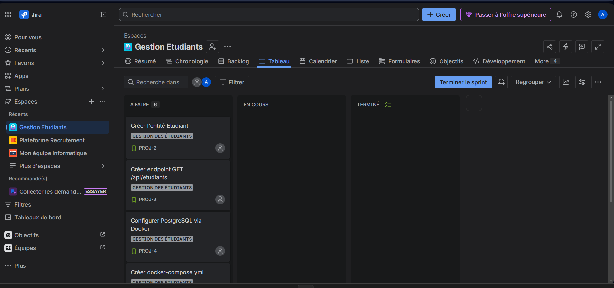

# Système de Gestion des Étudiants - Architecture Microservices

## Vue d'ensemble

Ce projet implémente un système complet de gestion des étudiants utilisant une architecture microservices avec Spring Boot, PostgreSQL, Redis, Eureka, API Gateway, Next.js et Flutter.

## Architecture Microservices

```
┌─────────────────────────────────────────────────────────────────┐
│                         Client Layer                             │
├──────────────────────────┬──────────────────────────────────────┤
│   Next.js Frontend       │      Flutter Mobile App              │
│   (Port 3000)            │      (Port 8090)                     │
└──────────────────────────┴──────────────────────────────────────┘
                              │
                              ▼
┌─────────────────────────────────────────────────────────────────┐
│                    API Gateway (Port 8888)                       │
│  Routes: /api/etudiants/**, /api/departements/**, /api/notes/** │
│  CORS, Load Balancing, Service Discovery                        │
└─────────────────────────────────────────────────────────────────┘
                              │
                              ▼
┌─────────────────────────────────────────────────────────────────┐
│              Eureka Server (Port 8761)                           │
│              Service Registry & Discovery                        │
└─────────────────────────────────────────────────────────────────┘
                              │
        ┌─────────────────────┼─────────────────────┐
        ▼                     ▼                     ▼
┌──────────────────┐  ┌──────────────────┐  ┌──────────────────┐
│ Etudiant Service │  │ Grading Service  │  │  Other Services  │
│   (Port 8080)    │  │   (Port 8081)    │  │                  │
│                  │  │                  │  │                  │
│ - Students       │  │ - Notes          │  │                  │
│ - Departments    │  │ - Feign Client   │  │                  │
│ - Redis Cache    │  │ - Redis Cache    │  │                  │
└──────────────────┘  └──────────────────┘  └──────────────────┘
        │                     │
        ▼                     ▼
┌──────────────────┐  ┌──────────────────┐
│   PostgreSQL     │  │      Redis       │
│   (Port 5432)    │  │   (Port 6379)    │
└──────────────────┘  └──────────────────┘
```

## Services

### 1. Eureka Server (Port 8761)
- **Description**: Service de découverte et registre des microservices
- **Dashboard**: http://localhost:8761
- **Technologie**: Spring Cloud Netflix Eureka Server

### 2. API Gateway (Port 8888)
- **Description**: Point d'entrée unique pour tous les microservices
- **Routes**:
  - `/api/etudiants/**` → Etudiant Service
  - `/api/departements/**` → Etudiant Service
  - `/api/notes/**` → Grading Service
- **Fonctionnalités**: Routage, Load Balancing, CORS
- **Health Check**: http://localhost:8888/actuator/health

### 3. Etudiant Service (Port 8080)
- **Description**: Gestion des étudiants et départements
- **Endpoints**:
  - `GET /api/etudiants` - Liste des étudiants
  - `GET /api/etudiants/{id}` - Détails d'un étudiant
  - `POST /api/etudiants` - Créer un étudiant
  - `PUT /api/etudiants/{id}` - Modifier un étudiant
  - `DELETE /api/etudiants/{id}` - Supprimer un étudiant
  - `GET /api/departements` - Liste des départements
  - `POST /api/departements` - Créer un département
- **Swagger**: http://localhost:8080/swagger-ui.html
- **Interface Web**: http://localhost:8080/index.html

### 4. Grading Service (Port 8081)
- **Description**: Gestion des notes des étudiants
- **Endpoints**:
  - `GET /api/notes` - Liste des notes
  - `GET /api/notes/{id}` - Détails d'une note
  - `POST /api/notes` - Créer une note
  - `PUT /api/notes/{id}` - Modifier une note
  - `DELETE /api/notes/{id}` - Supprimer une note
  - `GET /api/notes/etudiant/{studentId}/details` - Étudiant avec ses notes (Feign Client)
- **Swagger**: http://localhost:8081/swagger-ui.html
- **Feign Client**: Communication avec Etudiant Service

### 5. Next.js Frontend (Port 3000)
- **Description**: Interface web moderne pour l'administration
- **Pages**:
  - `/` - Page d'accueil
  - `/students` - Gestion des étudiants
  - `/departments` - Gestion des départements
  - `/grades` - Gestion des notes
- **Technologie**: Next.js 14, Tailwind CSS, TypeScript

### 6. Flutter Mobile App (Port 8090)
- **Description**: Application mobile pour consultation des étudiants
- **Fonctionnalités**:
  - Liste des étudiants
  - Filtre par département
  - Affichage des détails
  - Rafraîchissement des données

## Prérequis

- Java 21
- Maven 3.9+
- Docker & Docker Compose
- Node.js 20+ (pour Next.js)
- Flutter SDK (pour l'app mobile)
- PostgreSQL 15
- Redis 7

## Installation et Démarrage

### Option 1: Docker Compose (Recommandé)

1. **Cloner le projet**
```bash
git clone <repository-url>
cd projet-etudiants
```

2. **Démarrer tous les services**
```bash
docker-compose up -d
```

3. **Vérifier les services**
```bash
docker-compose ps
```

4. **Accéder aux services**:
- Eureka Dashboard: http://localhost:8761
- API Gateway: http://localhost:8888
- Etudiant Service: http://localhost:8080
- Grading Service: http://localhost:8081
- Next.js Frontend: http://localhost:3000

### Option 2: Exécution Locale

#### 1. Démarrer PostgreSQL et Redis
```bash
docker-compose up -d postgres redis
```

#### 2. Démarrer Eureka Server
```bash
cd eureka-server
mvn spring-boot:run
```

#### 3. Démarrer API Gateway
```bash
cd api-gateway
mvn spring-boot:run
```

#### 4. Démarrer Etudiant Service
```bash
cd spring-boot-api
mvn spring-boot:run
```

#### 5. Démarrer Grading Service
```bash
cd grading-service
mvn spring-boot:run
```

#### 6. Démarrer Next.js Frontend
```bash
cd frontend
npm install
npm run dev
```

#### 7. Démarrer Flutter App
```bash
cd mobile_app
flutter pub get
flutter run -d web-server --web-port=8090
```

## Tests

### Tests Unitaires et d'Intégration

**Etudiant Service:**
```bash
cd spring-boot-api
mvn test
```

**Grading Service:**
```bash
cd grading-service
mvn test
```

### Tests BDD (Cucumber)

**Etudiant Service:**
```bash
cd spring-boot-api
mvn test -Dtest=CucumberTest
```

**Grading Service:**
```bash
cd grading-service
mvn test -Dtest=CucumberTest
```

## Build et Publication des Images Docker

### 1. Build des images

```bash
# Eureka Server
cd eureka-server
docker build -t amal878/eureka-server:1.0 .

# API Gateway
cd api-gateway
docker build -t amal878/api-gateway:1.0 .

# Etudiant Service
cd spring-boot-api
docker build -t amal878/etudiant-service:2.0 .

# Grading Service
cd grading-service
docker build -t amal878/grading-service:1.0 .

# Next.js Frontend
cd frontend
docker build -t amal878/frontend:1.0 .
```

### 2. Push vers Docker Hub

```bash
docker login
docker push amal878/eureka-server:1.0
docker push amal878/api-gateway:1.0
docker push amal878/etudiant-service:2.0
docker push amal878/grading-service:1.0
docker push amal878/frontend:1.0
```

## Déploiement Kubernetes

### 1. Créer les secrets
```bash
kubectl create secret generic postgres-secret \
  --from-literal=username=student_user \
  --from-literal=password=student_pass
```

### 2. Déployer les services
```bash
kubectl apply -f k8s/postgres-deployment.yaml
kubectl apply -f k8s/redis-deployment.yaml
kubectl apply -f k8s/eureka-deployment.yaml
kubectl apply -f k8s/etudiant-deployment.yaml
kubectl apply -f k8s/grading-deployment.yaml
kubectl apply -f k8s/gateway-deployment.yaml
kubectl apply -f k8s/frontend-deployment.yaml
```

### 3. Vérifier les déploiements
```bash
kubectl get pods
kubectl get services
```

### 4. Accéder aux services
```bash
# Port forwarding pour accéder localement
kubectl port-forward service/api-gateway 8888:8888
kubectl port-forward service/eureka-server 8761:8761
kubectl port-forward service/frontend 3000:3000
```

## Variables d'Environnement

### Etudiant Service
- `SPRING_DATASOURCE_URL`: URL de la base de données PostgreSQL
- `SPRING_DATASOURCE_USERNAME`: Nom d'utilisateur PostgreSQL
- `SPRING_DATASOURCE_PASSWORD`: Mot de passe PostgreSQL
- `REDIS_HOST`: Hôte Redis
- `REDIS_PORT`: Port Redis
- `EUREKA_SERVER_URL`: URL du serveur Eureka

### Grading Service
- `SPRING_DATASOURCE_URL`: URL de la base de données PostgreSQL
- `SPRING_DATASOURCE_USERNAME`: Nom d'utilisateur PostgreSQL
- `SPRING_DATASOURCE_PASSWORD`: Mot de passe PostgreSQL
- `REDIS_HOST`: Hôte Redis
- `REDIS_PORT`: Port Redis
- `EUREKA_SERVER_URL`: URL du serveur Eureka

### API Gateway
- `EUREKA_SERVER_URL`: URL du serveur Eureka

## Stratégie de Cache (Redis)

### Etudiant Service
- **Cache**: `students`
- **Clés**: 
  - Tous les étudiants
  - Étudiant par ID
  - Étudiants par année d'inscription
- **Éviction**: Lors de la création, modification ou suppression

### Grading Service
- **Cache**: `notes`
- **Clés**:
  - Toutes les notes
  - Note par ID
  - Notes par étudiant ID
- **Éviction**: Lors de la création, modification ou suppression

## Communication Inter-Services

### Feign Client
Le Grading Service utilise Feign Client pour communiquer avec l'Etudiant Service:

```java
@FeignClient(name = "etudiant-service")
public interface StudentFeignClient {
    @GetMapping("/api/etudiants/{id}")
    StudentDTO getStudentById(@PathVariable Long id);
}
```

**Endpoint combiné**: `GET /api/notes/etudiant/{studentId}/details`
- Récupère les informations de l'étudiant via Feign Client
- Récupère toutes les notes de l'étudiant
- Retourne un objet combiné avec les deux informations

## Conventions de Code Review

### Avant de soumettre une PR:
1. ✅ Le code compile sans erreurs
2. ✅ Tous les tests passent
3. ✅ Le code suit les conventions de style du projet
4. ✅ Les commentaires sont clairs et en français
5. ✅ Pas de code commenté inutile
6. ✅ Pas de dépendances Lombok (utiliser getters/setters manuels)
7. ✅ Les DTOs ont des validations appropriées
8. ✅ Les services utilisent @Transactional
9. ✅ Les controllers ont des annotations Swagger
10. ✅ Les exceptions sont gérées globalement

### Processus de Review:
1. Créer une branche depuis `version-3`
2. Faire les modifications
3. Créer une PR avec le template fourni
4. Lier le ticket Jira
5. Attendre l'approbation de 2 reviewers
6. Merger après approbation

### Naming Conventions:
- **Branches**: `feature/PROJ-XXX-description`, `bugfix/PROJ-XXX-description`
- **Commits**: `[PROJ-XXX] Description du changement`
- **Classes**: PascalCase
- **Méthodes**: camelCase
- **Constants**: UPPER_SNAKE_CASE

## Troubleshooting

### Eureka Server ne démarre pas
- Vérifier que le port 8761 est libre
- Vérifier les logs: `docker logs eureka-server`

### Service ne s'enregistre pas avec Eureka
- Vérifier la variable `EUREKA_SERVER_URL`
- Vérifier que Eureka Server est démarré
- Attendre 30 secondes pour l'enregistrement

### Feign Client échoue
- Vérifier que l'Etudiant Service est enregistré dans Eureka
- Vérifier les logs du Grading Service
- Vérifier que l'API Gateway route correctement

### Redis connection refused
- Vérifier que Redis est démarré: `docker ps | grep redis`
- Vérifier les variables `REDIS_HOST` et `REDIS_PORT`

### PostgreSQL connection refused
- Vérifier que PostgreSQL est démarré: `docker ps | grep postgres`
- Vérifier les credentials dans les variables d'environnement

## Technologies Utilisées

### Backend
- Spring Boot 3.2.1
- Spring Cloud (Eureka, Gateway, OpenFeign)
- Spring Data JPA
- PostgreSQL 15
- Redis 7
- Swagger/OpenAPI 3
- Cucumber (BDD)
- JUnit 5

### Frontend
- Next.js 14
- React 18
- Tailwind CSS
- TypeScript

### Mobile
- Flutter 3.x
- Dart

### DevOps
- Docker & Docker Compose
- Kubernetes
- Maven
- Git

## 📊 Gestion de Projet avec Jira

### Organisation des Sprints

Ce projet est organisé en 4 sprints Scrum dans Jira:

#### Sprint 1 - API REST de Base (Partie 1)
- 6 User Stories (PROJ-1 à PROJ-6)
- Entité Etudiant avec JPA
- Endpoint GET /api/etudiants
- Configuration PostgreSQL Docker
- Docker Compose
- Données initiales
- Dépôt GitHub

#### Sprint 2 - Enrichissement (Partie 2)
- 12 User Stories (PROJ-7 à PROJ-18)
- Branche version-2
- Méthode age() et tests BDD Cucumber
- Page index.html avec Fetch JS
- Publication Docker Hub
- Manifests Kubernetes K3S
- Entité Département + relation ManyToOne
- Architecture en couches propre
- CRUD complet Etudiant et Département
- Gestion erreurs HTTP
- Documentation Swagger OpenAPI
- Cache Redis

#### Sprint 3 - Architecture Micro Services (Partie 3)
- 9 User Stories (PROJ-19 à PROJ-27)
- Branche version-3
- Workflow GitHub avec protection branches
- Micro service grading-service
- Eureka Server
- Feign Client
- API Gateway
- Application mobile avec filtre département
- Frontend Next.js
- Docker Compose unifié

#### Sprint 4 - Tests et Qualité (Partie 4)
- 9 User Stories (PROJ-28 à PROJ-36)
- Branche version-4
- Tests unitaires JUnit + Mockito
- Tests d'intégration Testcontainers
- Tests E2E Cypress
- Tests de stress Gatling
- Couverture JaCoCo ≥ 80%
- Intégration GitHub ↔ Jira
- Intégration Xray
- Micro service Auth Express MongoDB JWT

### Epic: Gestion des Étudiants
Toutes les 36 User Stories sont liées à l'Epic "Gestion des Étudiants" qui couvre le développement complet du système.

### Documentation Jira
- **[GUIDE_JIRA_COMPLET.md](./GUIDE_JIRA_COMPLET.md)** - Guide complet des 4 sprints (36 stories)
- **[Board Jira](https://amalyousef356.atlassian.net/jira/software/projects/PROJ/boards/100)** - Accès direct au board Scrum

### Board Jira - Sprint 1

**Lien du board:** [https://amalyousef356.atlassian.net/jira/software/projects/PROJ/boards/100](https://amalyousef356.atlassian.net/jira/software/projects/PROJ/boards/100)



Le board Jira montre les 6 User Stories du Sprint 1 (PROJ-1 à PROJ-6) organisées en colonnes:
- **À FAIRE**: Stories en attente
- **EN COURS**: Stories en développement
- **TERMINÉ**: Stories complétées

---

## 📚 Documentation Complète

- **[GUIDE_JIRA_COMPLET.md](./GUIDE_JIRA_COMPLET.md)** - Guide Jira complet (36 User Stories)
- **[PARTIE4_IMPLEMENTATION.md](./PARTIE4_IMPLEMENTATION.md)** - Plan d'implémentation Partie 4
- **[PARTIE4_PROGRESS.md](./PARTIE4_PROGRESS.md)** - Progression et résultats des tests
- **[PARTIE4_GITHUB_JIRA_INTEGRATION.md](./PARTIE4_GITHUB_JIRA_INTEGRATION.md)** - Intégration GitHub ↔ Jira
- **[CONTRIBUTING.md](./CONTRIBUTING.md)** - Guide de contribution

---

## Auteurs

- Développé dans le cadre du TP Intégration des Compétences
- Docker Hub: amal878

## Licence

Ce projet est développé à des fins éducatives.
